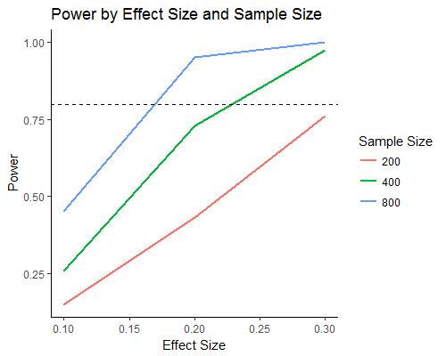
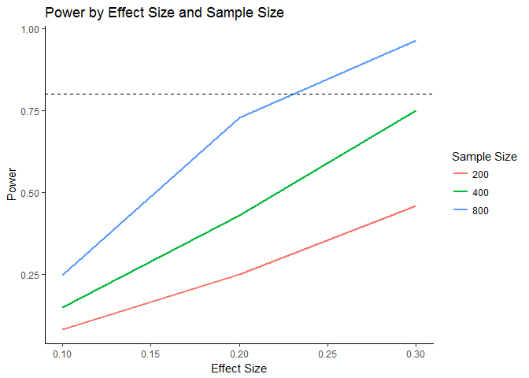

# Getting Started

## Objective 

After using this guide,  you will be able to: 

1. Estimate the sample size required for a randomized study using a simulation. You will create power plots that will help you to interpret the results.

2. Make recommendations to leadership at your organization about how many participants (i.e. students, schools, etc) to include in a randomized study to test the impact of an intervention, policy, or program.

3. Understand the relationship between statistical power, type I error rates, type II error rates, effect size, and sample size. 


## Why Worry about Sample Size?

Whenever you are designing a randomized study to evaluate an intervention, test a new program, or pilot a policy, you will need to determine how many subjects (schools, teachers, students, etc.) to include in your study so that you can successfully determine whether the intervention/program/policy worked. If your sample is too small, you increase your risk of not being able to tell whether or not the intervention actually had an effect. You also want to choose a sample that is not too large so that the resources and funding required is minimized. Often sample sizes are determined by intuition, rules of thumb, financial restrictions, or political decisions. However, there are also statistical methods for determining appropriate sample sizes. Leaders at your organization may not know that it can be relatively easy to systematically determine appropriate sample sizes using statistics. This guide will show you how. 

You will work through the determination of the optimal sample size for an online intervention designed to to improve the mathematics achievement at a school. You will run statistical power simulations, which will give you a new way to assess how large of a sample you need to have in order to be able to detect whether or not the intervention works. 

## Designing a Randomized Study

This guide assumes that your aim is to determine a sample size for a randomized study design. The sample size calculations presented here can serve as a rough guide for observational studies, but must be interpreted cautiously. 

## Prior Knowledge 

To get the most out of this this guide you should have some knowledge of coding in R and prior knowledge of type I and type II error, power, and effect sizes. A review of these concepts is presented in the next section and a more detailed overview is available in the Appendix. 

# Review of Key Concepts

## Type I Error, Type II Error, and Power

Despite using the best statistical methods, you will sometimes conclude that an intervention works (i.e has an effect) when in reality it doesn't. At other times, you will conclude based on the data that an intervention has no effect, when in fact it does. These errors don't occur because of any fault on the part of the researcher, but are simply because of chance. Typically, analyses focus on preventing the first type of error (called "**Type I Error** ($\alpha$)"). However, the latter error (called "**Type II Error** ($\beta$)") can also be very important, particularly in education policy settings where interventions can be costly and require a lot of time and energy from school staff, students, and families. **Statistical Power** is the inverse of Type II Error and is equal to $(1 - \beta)$. Conceptually, Power is the likelihood of correctly finding that an intervention has an effect when it truly does. As a rule of thumb, you generally want the power of your studies to be around 80% - that is, you want your study design to be able to detect an effect if there is one 80% of the time.

The table below summarizes the conceptual relationship between Type I and Type II Error ($H_0$ is the Null Hypothesis and $H_A$ is the Alternative Hypothesis: 
 
|                                                 | Fail to reject Ho       | Reject Ho                 |
|------------------------------------------------ | :----------------------:| :------------------------:|
|$H_0$ is actually True (There is no effect)      | Correct conclusion      | Type I Error ($\alpha$)   |
|$H_A$ is actually True (There is an effect)      | Type II Error ($\beta$) | Correct conclusion        |

## Effect Size

One of the other challenges of determining the sample size needed for a study is that several of the key pieces of information that are used to decide how many participants to include are *unknown*. Therefore, you must make assumptions grounded in available data and/or prior research to estimated your needed sample size. In particular, you'll need to make an educated assumption about how big of an **effect** you expect to see from your intervention. 

If you expect your intervention to have a small effect, you will need to include more participants in your study so that you will be able to detect a small effect. If you expect a wide variation in the outcome that you are using, you also need to increase your sample size to be able to differentiate between observing an effect because the intervention worked or if the difference is just occurring by chance. Typically, the effect size is the standardized mean difference defined as

$$EffectSize = \frac{mean(Outcome_T) - mean(Outcome_C)}{SD_{pooled}}$$

In other settings, the correlation between two variables can be used as the effect size.

## Summary

The table below summarizes how changes in your assumptions can impact the sample size needed to be able to detect the effect of an intervention.

                  
|                  Assumptions                  | Impact on necessary Sample Size     |   
| :-------------------------------------------: | :----------------------------------:| 
| Expect Large Effect Size                      | Lower sample size needed to detect  | 
| Expect Small Effect Size                      | Higher sample size needed to detect | 
| Desire Higher Power (lower chance of type II error)  | Higher sample size needed           | 
| Desire Lower Power (higher chance of type II error)  | Lower sample size needed            | 


# Calculating Power with Simulations

For basic experiments, you can sometimes estimate an appropriate sample size directly using a mathematical calculation (See Appendix) However, experiments in education settings are often more complicated experimental designs and cases where the data is nested or hierarchical (such as students within schools). These designs require more assumptions and sample sizes are more complex (or impossible) to calculate directly. 

When you have a more complicated design, instead of calculating power and sample sizes directly you can use statistical simulation. A **power simulation** takes a sample of students from your data, randomly assigns students to treatment and control, and calculates a treatment effect. This process is repeated across many samples and the results are averaged to estimate the liklihood of properly rejecting the hull hypothesis.  The proportion of samples for which you find a significant treatment effect is a good estimate of the power under the given assumptions. This technique allows you to test a variety of different sample sizes and effect sizes before actually conducting your experiment so you can confidently recommend a sample size for your study.

## Scenario

Suppose you work for Sylvan High School, which has a student body of 2207 students. You want to conduct a randomized experiment on a new online mathematics program that provides students with individualized math support using a video game format. The goal of the intervention is to increase engagement and increase student achievement in school. If the program works, your school might decide to use the program with all students, but your principal wants to be confident that the program will help improve learning before spending the time and resources on the program. You are asked to estimate how many students should be included in a pilot so that you can determine whether the program works and whether the effect of the program on student achievement is big enough to warrant using valuable time to run and manage the program.

Use the code below to load the data set: **Sample Size Tutorial Datasets.Rdata** 


```r
# Datafiles were simplified and adjusted using the file: 
# C:\Users\coh334\Google Drive\Other\CEPR\Open SDP\Statistical Power\WORK\Create Final Datasets for Sample Size Tutorial.R
# 2 datafiles: NCTE (multilevel district data) and Sylvan (single school)
setwd("C:/Users/coh334/Google Drive/Other/CEPR/Open SDP/Statistical Power/Sample Size Draft3 Markdown")
load("Sample Size Tutorial Datasets.Rdata")
```

The `Sylvan` data set is summarized below. 


```r
summary(Sylvan)
```

```
##       sid         pct_absent_in_ms      male        race_ethnicity    
##  Min.   :    38   Min.   : 0.000   Min.   :0.0000   Length:2207       
##  1st Qu.: 27379   1st Qu.: 3.546   1st Qu.:0.0000   Class :character  
##  Median : 56855   Median : 7.110   Median :1.0000   Mode  :character  
##  Mean   : 56111   Mean   :10.094   Mean   :0.5381                     
##  3rd Qu.: 84003   3rd Qu.:13.775   3rd Qu.:1.0000                     
##  Max.   :111924   Max.   :66.514   Max.   :1.0000                     
##                                    NA's   :1                          
##       frpl             sped              lep          scale_score_8_read
##  Min.   :0.0000   Min.   :0.00000   Min.   :0.00000   Min.   : 0.0      
##  1st Qu.:0.0000   1st Qu.:0.00000   1st Qu.:0.00000   1st Qu.:32.0      
##  Median :1.0000   Median :0.00000   Median :0.00000   Median :45.0      
##  Mean   :0.5193   Mean   :0.09017   Mean   :0.04531   Mean   :43.6      
##  3rd Qu.:1.0000   3rd Qu.:0.00000   3rd Qu.:0.00000   3rd Qu.:55.0      
##  Max.   :1.0000   Max.   :1.00000   Max.   :1.00000   Max.   :80.0      
##                                                       NA's   :517       
##  scale_score_8_math  ClassroomID   
##  Min.   : 0.00      Min.   : 1.00  
##  1st Qu.:18.00      1st Qu.:19.00  
##  Median :37.00      Median :38.00  
##  Mean   :36.05      Mean   :38.25  
##  3rd Qu.:53.00      3rd Qu.:57.00  
##  Max.   :80.00      Max.   :75.00  
##  NA's   :504
```

## Testing one sample

Generally, you want the power of any randomized experiment to be at least 0.8, so the goal is to find the minimum sample size that will meet that criteria. You will start by testing to see if including 200 students in the study (100 in the treatment and 100 in the control) will have enough power.

You have to make some assumptions to start: 
- Your outcome of interest is the state standardized test scores at the end of this year (which has not been collected yet)
- Your "pretest" measure is the students' 8th grade math achievement (scale_score_8_math)
- If the intervention works, the effect size is 0.2 SD
- The variance of the outcome is equivalent to the variance of scale_score_8_math

You will start by taking one sample from the data to test whether you'll get a type II error. 

0. **Define Parameters to test**: In this case, you need to define the sample size and effect size that you are testing based on your assumptions above. 

    
    ```r
    set.seed(5)
    
    # Define sample size to test
    sample.size <- 200
    
    # Define effect size in standard deviations
    effect.size.SD <- 0.2 # (Effect in SD) 
    ```


1. **Select a subset of student to participate**: Create a new subset of the full data set called "S.sample" which has a random sample of 200 students.

    
    ```r
    total.n <- 1456 # Total number of students in the school
    S.sample <- Sylvan[sample(1:total.n, sample.size),]
    ```

2. **Assign students to treatment**: Create a variable called "T.Status" which is 1 for students assigned to treatment and 0 for students assigned to the control. In the code below half of the students are assigned to the treatment group and half to the control group, but you could change the proportion if you want a larger or smaller number of students to receive treatment.  
      
    
    ```r
    # Among the sample chosen, assign half to treatment and half to control
    S.sample$T.status <- 0 
    S.sample$T.status[sample(1:sample.size, sample.size*0.5)] <- 1
    table(S.sample$T.status) # Frequency table of how many 
    ```
    
    ```
    ## 
    ##   0   1 
    ## 100 100
    ```
    
    ```r
                             # students are assigned to treatment and control
    ```
    
3. **Assign outcome to treated and control students**: Because you haven't *actually* run the experiment yet, you don't know the true absence percent outcome for each student. However, for the simulation you will assume that if students are in the control group, you will assume that their achievement will not change from their score in 8th grade. For the treatment group, you will assume that there is a homogeneous treatment effect size of 0.2 SD. This means that if students are in the treatment group, you will assign their score to be 0.2 SD greater than their 8th grade math score. In this example, one standard deviation is about 21.6 points, so 0.2 SD would be a 4.3 point increase in score this year.  
         
    
    ```r
    # Effect size in scale score points
    effect.size <- effect.size.SD * sd(Sylvan$scale_score_8_math, na.rm = TRUE)
    
    S.sample$outcome <-S.sample$scale_score_8_math
    S.sample$outcome[S.sample$T.status == 1] <-   
      S.sample$scale_score_8_math[S.sample$T.status == 1] + effect.size
    ```
        
        
4. **Estimate treatment effect**: The treatment effect can be estimated in several ways, including using a simple difference in means or a linear model (as shown in the code below). As shown below, the treatment effect is estimated to be 13.5 points. You can also include additional covariates in the model at this step. 
    
    
    ```r
    out.mod <- lm(outcome ~ T.status, data = S.sample) 
    
    summary(out.mod)
    ```
    
    ```
    ## 
    ## Call:
    ## lm(formula = outcome ~ T.status, data = S.sample)
    ## 
    ## Residuals:
    ##     Min      1Q  Median      3Q     Max 
    ## -33.397 -16.994  -0.397  12.603  47.410 
    ## 
    ## Coefficients:
    ##             Estimate Std. Error t value Pr(>|t|)    
    ## (Intercept)   33.397      2.527   13.21   <2e-16 ***
    ## T.status       3.693      3.516    1.05    0.295    
    ## ---
    ## Signif. codes:  0 '***' 0.001 '**' 0.01 '*' 0.05 '.' 0.1 ' ' 1
    ## 
    ## Residual standard error: 21.59 on 149 degrees of freedom
    ##   (49 observations deleted due to missingness)
    ## Multiple R-squared:  0.007349,	Adjusted R-squared:  0.0006865 
    ## F-statistic: 1.103 on 1 and 149 DF,  p-value: 0.2953
    ```
      
5. **Extract key statistics**: Using your model output, extract the treatment effect coefficient, standard error, degrees of freedom, p value, and the number of records with data that were used (N). In the code below, each of these statistics is stored as a variable which will later be stored together as a vector of statistics representing the results from this sample from the data. 

    
    ```r
    # Treatment estimate
    T.coef <- summary(out.mod)$coef["T.status" , "Estimate"]
    
    # Standard Error of Treatment estimate
    T.se   <- summary(out.mod)$coef["T.status" ,  "Std. Error"] 
    
    # degrees of freedom
    df <- out.mod$df.residual  
    
    # cdf t for 2 tailed pvalue
    T.pval <- 2*(pt(-abs(T.coef / T.se) , df = df)) 
    
    # final N count of students who were included in the analysis
    N <- sum(complete.cases(S.sample[, c("outcome" , "T.status")])) 
    ```
        
6. **Determine if you made a type II error**: Because of the way that you set up the data, you have already made the assumption that there is an effect of the intervention. In other words, you are assuming that the Alternative Hypothesis is true. If you fail to reject the null hypothesis by getting a p value of greater than 0.05, then you have made a type II error.  The code below creates a new variable which is "True" if at type II error was made and "False" if you made the correct decision.

    
    ```r
    typeIIerror <- T.pval >= 0.05
    ```

7. **Store model statistics as a vector**: Combine all of your results and statistics from this sample together into a single vector called "sample.stats". When you run the simulation, you will eventually want to combine all of the individual sample statistics together into a matrix where each row represents the statistics from one sample (The next section will show you how). 

    
    ```r
    sample.stats <- c(iteration = 1, sample.size = sample.size ,          
       effect.size = effect.size.SD ,
       T.coef = T.coef , 
       T.se = T.se , T.pval = T.pval , df = df , 
       typeIIerror = typeIIerror , N = N)
    
    sample.stats
    ```
    
    ```
    ##   iteration sample.size effect.size      T.coef        T.se      T.pval 
    ##   1.0000000 200.0000000   0.2000000   3.6930396   3.5163035   0.2952982 
    ##          df typeIIerror           N 
    ## 149.0000000   1.0000000 151.0000000
    ```


### What about power? 

Because power is the likelihood of NOT making a type II error, you cannot calculate the power from one sample of the data set. The method and code presented above for one sample can be repeated many times using loops. Each time a new sample is drawn and sample statistics calculated, you call it an iteration. A simulation is made up of many iterations. You can then calculate the type II error rate ($\beta$) by calculating the proportion of iterations where a type II error was made. The power is the inverse: ($1-\beta$). 

The next section demonstrates how to use loops to run a simulation with multiple iterations.

## Looping over many samples

The code below puts Steps 1 through 7 in a loop so that multiple samples are drawn from the data, students are assigned randomly to treatment, and a treatment effect and p value are calculated. For each iteration of the simulation, two steps are added to store the results and clear the results from one iteration to prepare for the next: 

8. **Save iteration results**: In the previous step, all of the results for the given sample were saved into a vector. This step adds each subsequent results vector (sample.stats) to a matrix which will contain all of the results for all iterations, one vector per row. 

9. **Remove all iteration-specific variables (except all.stats results matrix)**: To clean up the simulation along the way, it is good practice to remove all sample-specific variables before the next iteration begins. Doing so prevents errors in the code from slipping through from one iteration to the next. 


The code below continues the previous example but shows how all 9 steps can be combined into a loop with 1000 iterations. Your goal is to find the power of a randomized experiment where the effect size is 0.2SD and the sample size is 200. 


```r
# ---------- Simulation Preparation ----------
# STEP 0: Define Parameters
set.seed(5)

# Define sample size to test
sample.size <- 200

# Define effect size in standard deviations
effect.size.SD <- 0.2 # (Effect in SD) Effect size is negative because intervention reduces absences

# ----------- Run Simulation ---------------

for(i in 1:1000){
  # STEP 1: Select a subset of student to participate
  total.n <- 1456 # Total number of students in the school
  S.sample <- Sylvan[sample(1:total.n, sample.size),]
  
  # STEP 2: Assign students to treatment
  # Among the sample chosen, assign half to treatment and half to control
  S.sample$T.status <- 0 
  S.sample$T.status[sample(1:sample.size, sample.size*0.5)] <- 1
  
  # STEP 3: Assign outcome to treated and control students
  # Effect size in scale score points
  effect.size <- effect.size.SD * sd(Sylvan$scale_score_8_math, na.rm = TRUE) 
  S.sample$outcome <-S.sample$scale_score_8_math
  S.sample$outcome[S.sample$T.status == 1] <-
    S.sample$scale_score_8_math[S.sample$T.status == 1] + effect.size
 
  # STEP 4: Estimate treatment effect
  out.mod <- lm(outcome ~ T.status, data = S.sample) 
  
  # STEP 5: Extract Key Statistics
  # Treatment estimate
  T.coef <- summary(out.mod)$coef["T.status" , "Estimate"]
  
  # Standard Error of Treatment estimate
  T.se   <- summary(out.mod)$coef["T.status" ,  "Std. Error"] 
  
  # degrees of freedom
  df <- out.mod$df.residual  
  
  # cdf t for 2 tailed pvalue
  T.pval <- 2*(pt(-abs(T.coef / T.se) , df = df)) 
  
  # final N count of students who were included in the analysis
  N <- sum(complete.cases(S.sample[, c("outcome" , "T.status")])) 
  
  # STEP 6: Determine if you made a type II error
  typeIIerror <- T.pval >= 0.05
  
  # STEP 7: Store model statistics as a vector
  sample.stats <- c(iteration = i, sample.size = sample.size ,          
   effect.size = effect.size.SD , 
   T.coef = T.coef , 
   T.se = T.se , T.pval = T.pval , df = df , 
   typeIIerror = typeIIerror , N = N)

  # STEP 8: Save iteration results
  # if this is the first iteration, there will only be one row
  # in the results matrix
  if(i == 1){results <- data.frame(t(sample.stats))} 
  
  # each subsequent iteration stats will be added to the prior
  else{results <- rbind(results, sample.stats)} 
  
  # STEP 9: Remove all iteration-specific variables 
  remove(sample.stats, S.sample, T.coef, T.se, 
         df, T.pval, N, typeIIerror, out.mod)
  
}

head(results)
```

```
##   iteration sample.size effect.size     T.coef     T.se     T.pval  df
## 1         1         200         0.2  3.6930396 3.516304 0.29529817 149
## 2         2         200         0.2  6.2993175 3.448106 0.06952297 165
## 3         3         200         0.2  1.2111511 3.554860 0.73380394 150
## 4         4         200         0.2 -0.7038088 3.551390 0.84316687 154
## 5         5         200         0.2  0.8872230 3.567720 0.80395258 148
## 6         6         200         0.2  0.4205219 3.275674 0.89800680 165
##   typeIIerror   N
## 1           1 151
## 2           1 167
## 3           1 152
## 4           1 156
## 5           1 150
## 6           1 167
```

### Calculating Power

From the results matrix (`results`), you can calculate the type II error rate by calculating the proportion of iterations where you made a type II error.  


```r
# frequency count of type II error (1) and correct decision (0)
table(results$typeIIerror) 
```

```
## 
##   0   1 
## 243 757
```

In this example, 757 samples out of 1000 failed to reject the null hypothesis (p>0.05) despite there being a treatment effect, so $\beta =$ 0.757 . Thus, you can expect that if you choose 200 students for the randomized study and the true effect size is 0.2, the power would be 0.243. This power is lower than the desired 0.8. 

## Simultaneously Testing Multiple Sample Sizes and Effect sizes

If you are trying to determine an appropriate sample size, you'll want to calculate the power of more than one option so you can see how much your power changes if you increase or decrease your sample size. You may also want to test different effect sizes to see how sensitive your power will be if the effect size is different than you assume. 

To test different parameters, you can simply run the same simulation again using the changed parameters, or you can add additional loops so that you can test all of the parameters at once.  The code in the next section gives an example of how to do the second option. The results from this multi-parameter simulation allow the opportunity to make graphs that show the relationship between your sample size, effect size, and power (called Power curves).

### Multi-Parameter Simulation

To test multiple parameters (sample size, effect size) as part of the same simulation, only slight changes need to be made to the code: 

- Rather than define parameters as a single value, specify vectors that contain the parameter values that you wish to test.

- Add in two additional nested loops: one loop over the `k` sample sizes and one loop over the `j` effect sizes

- Everywhere in the code where the `sample.size` or `effect.size.SD` variable are used, change to `sample.size[k]` and `effect.size[j]` to select only the relevant effect and sample sizes.


```r
# ---------- Simulation Preparation ----------
# STEP 0: Define Parameters
set.seed(5)

# Define sample size to test
sample.size <- c(200, 400, 800)

# Define effect size in standard deviations
effect.size.SD <- c(0.1, 0.2, 0.3) 

# ----------- Run Simulation ---------------
for(k in 1:length(sample.size)){
  for(j in 1:length(effect.size.SD)){
    for(i in 1:1000){
      # STEP 1: Select a subset of student to participate
      total.n <- 1456 # Total number of students in the school
      S.sample <- Sylvan[sample(1:total.n, sample.size[k]),]
      
      # STEP 2: Assign students to treatment
      # Among the sample chosen, assign half to treatment and half to control
      S.sample$T.status <- 0 
      S.sample$T.status[sample(1:sample.size[k], sample.size[k]*0.5)] <- 1
      
      # STEP 3: Assign outcome to treated and control students
      # Effect size in scale score points
      effect.size <- effect.size.SD[j] * 
        sd(Sylvan$scale_score_8_math, na.rm = TRUE) 
      S.sample$outcome <-S.sample$scale_score_8_math
      S.sample$outcome[S.sample$T.status == 1] <-
        S.sample$scale_score_8_math[S.sample$T.status == 1] + effect.size
      
      # STEP 4: Estimate treatment effect
      out.mod <- lm(outcome ~ T.status, data = S.sample) 
      
      # STEP 5: Extract Key Statistics
      # Treatment estimate
      T.coef <- summary(out.mod)$coef["T.status" , "Estimate"]
      
      # Standard Error of Treatment estimate
      T.se   <- summary(out.mod)$coef["T.status" ,  "Std. Error"] 
      
      # degrees of freedom
      df <- out.mod$df.residual  
      
      # cdf t for 2 tailed pvalue
      T.pval <- 2*(pt(-abs(T.coef / T.se) , df = df)) 
      
      # final N count of students who were included in the analysis
      N <- sum(complete.cases(S.sample[, c("outcome" , "T.status")])) 
      
      # STEP 6: Determine if you made a type II error
      typeIIerror <- T.pval >= 0.05
      
      # STEP 7: Store model statistics as a vector
      sample.stats <- c(iteration = i, sample.size = sample.size[k] ,          
       effect.size = effect.size.SD[j] , 
       T.coef = T.coef , 
       T.se = T.se , T.pval = T.pval , df = df , 
       typeIIerror = typeIIerror , N = N)
    
      # STEP 8: Save iteration results
      # if this is the first iteration, there will only be one row
      # in the results matrix
      if(i == 1 & j == 1 & k == 1){results <- data.frame(t(sample.stats))} 
      # each subsequent iteration stats will be added to the prior   
      else{results <- rbind(results, sample.stats)} 
                                                         
      # STEP 9: Remove all iteration-specific variables 
      remove(sample.stats, S.sample, T.coef, T.se, df, 
             T.pval, N, typeIIerror, out.mod)
      
    }
  }
}
```

### Calculating Power with multiple parameters

Unlike when the simulation had only one set of parameters (sample size = 200, effect size = 0.2), now you have 9 combinations of parameters for which you can calculate type II error rates and power.  You can individually find the proportion of iterations for each set of parameters, or you can use the `aggregate` function to calculate the proportion of type II errors made for each set of parameters simultaneously, as shown in the code below


```r
# summarize results to calculate type II error and power
# Average the number of type II errors made over the input 
# values for proportion treated, n size, and effect size
summary.results <- aggregate(list(typeIIerror = results$typeIIerror), 
                             by = list( sample.size = results$sample.size, 
                                        effect.size = results$effect.size ),
                             mean)
```

You can then calculate the power by taking the inverse of the type II error rate: 


```r
# calculate the power
summary.results$power <- 1-summary.results$typeIIerror

summary.results
```

```
##   sample.size effect.size typeIIerror power
## 1         200         0.1       0.919 0.081
## 2         400         0.1       0.851 0.149
## 3         800         0.1       0.752 0.248
## 4         200         0.2       0.751 0.249
## 5         400         0.2       0.569 0.431
## 6         800         0.2       0.271 0.729
## 7         200         0.3       0.540 0.460
## 8         400         0.3       0.250 0.750
## 9         800         0.3       0.035 0.965
```


# Plotting Simulation Results

Results from your power simulation can also be plotted using a "power curve" plot. This type of chart displays the relationship between the effect size (on the x axis) with the the power of the study (on the y axis). For each sample size in the simulation, you add a separate power curve. In the plot below, a horizontal dotted line has been added to show the 80% power threshold that you are aiming for. 

The code below uses the package "ggplot2" to create these graphs. The primary data structure required to make the plot is the same as the summary of results output (`summary.results`) above. Each row of the data set must represent the input parameters for the simulation (effect.size and sample.size) and the calculated power ($1 - mean(TypeIIError)$).


```r
# --------------------------
# Plot Results
# --------------------------
library(ggplot2)

power.plot <- ggplot(summary.results, aes(x = effect.size, y = power, 
                                          group = sample.size))

power.plot + geom_line(aes(color = as.factor(sample.size)), size = .8) +
  ggtitle("Power by Effect Size and Sample Size") +
  xlab("Effect Size") +
  ylab("Power") + theme_classic() + 
  geom_hline(yintercept = 0.8, linetype = "dashed") + 
  labs(color = "Sample Size")
```

<!-- -->

# Interpreting the results

Based on the summary of results and the power plot, you can see: 

1. Power is larger when you use a larger sample size.

2. Power is larger when you can assume a larger effect size.

Based on this information, how do you make your final decision about how many participants to include in your study? 

**Statistical Decision**: From a statistical perspective, the rule of thumb is to pick a sample size that is big enough to achieve 80% power for a reasonable effect size. For example, in this example, the power plot shows three power curves for each of 3 sample sizes (200, 400, or 800 students) at three effect sizes (0.1 SD, 0.2 SD, and 0.3 SD). You can rule out using a sample size of 200 students because the power is never above 80%. If you assume that the effect size of the intervention will be large (0.3), then including 400 students in the study will yield close large enough power. However, if you want to be able to detect smaller effect sizes (as low as 0.2), then you should advocate for including as many as 800 students in the study.  

**Logistical/Practical Decision**: Sometimes, you won't have enough subjects (schools, etc.) to be able to have a large enough sample size to have high power. Other times, financial or resource limitations will prevent you from being able to collect data from enough subjects to have high power or to detect low effect sizes. In still other circumstances, the political reasons for running a study will outweigh the statistical concerns and a study will have to be conducted with lower power. When these factors come into play, power calculations might help you to objectively weigh the impact of giving an intervention to a smaller sample than needed. If you don't consider power, your organization risks spending money, resources, and time on an intervention that might in fact work, but if your sample size is too small you might not be able to prove that it does.


# Extending the simulation

This basic simulation can be extended and made more realistic in a variety of ways: 

1. Estimating sample sizes when treatment is assigned at the cluster (classroom, school, etc) level

2. Controlling for additional covariates while calculating the treatment effects


## Clustered Treatment Assignment

When treatment cannot be assigned at the student level, it is common in education to assign treatment at the classroom or school level - this is called "cluster-randomized design." If you are considering randomizing your treatment assignment at the cluster-level rather than the student-level, you should adjust your simulation to reflect this design. For example, if you were to assign the online math intervention randomly to classrooms at Sylvan High rather than to individual students, you should make the following adjustments: 

- Step 0: Change sample size parameters to reflect numbers of classrooms rather than numbers of students
    
    ```r
    set.seed(5)
    # STEP 0: Set parameters
    sample.size <- 20 # Number of classrooms
    effect.size.SD <- 0.2
    ```
- Step 1: Instead of selecting students individually to be in the sample, instead select a set of classrooms and all of the students within them.  

    
    ```r
    # Total number of classrooms (numbered 1 - 50)
    total.class <- 50 
    
    # Select 20 classrooms from the 50 given
    S.class <- sample(1:50, sample.size)
    
    # Select all students from each of the 20 classrooms in S.class
    S.sample <- Sylvan[is.element(Sylvan$ClassroomID, S.class),]
    ```

- Step 2: Randomly select half of the *classrooms* in the sample to receive treatment and assign all students in those classroom to treatment

    
    ```r
    # select half of the classrooms to recieve treatment
    S.class.treat <- sample(S.class, round(sample.size*.5, 0))
    
    # Assign treatmetn to the students in the treatment classrooms  
    S.sample$T.status <- 0 
    S.sample$T.status[is.element(S.sample$ClassroomID, S.class.treat)] <- 1
    # Frequency of treatment assignment
    table(S.sample$T.status)  
    ```
    
    ```
    ## 
    ##   0   1 
    ## 276 324
    ```

         
    
        

- Steps 4 & 5: Use a multilevel model to estimate your treatment effect (you can use the package `lme4`)

    
    ```r
    library(lme4)
    ```
    
    ```
    ## Loading required package: Matrix
    ```
    
    ```r
    # STEP 4: Estimate mulilevel model
    out.mod <- lmer(outcome ~ T.status + (1 | ClassroomID), 
                         data = S.sample)
        
      
    # STEP 5: Save key Statistics 
    # Treatment estimate
    T.coef <- summary(out.mod)$coef["T.status" , "Estimate"]
    
    # Standard Error of Treatment estimate
    T.se   <- summary(out.mod)$coef["T.status" ,  "Std. Error"]
        
    # degrees of freedom
    df <- ngrps(out.mod)[ c("ClassroomID")] - 1 - 1
        
    # cdf t for 2 tailed pvalue
    T.pval <- 2*(pt(-abs(T.coef / T.se) , df = df)) 
        
    # final N count of students who were included in the analysis
    N <- sum(complete.cases(S.sample[, c("outcome" , "T.status")]))
    ```
        
- Steps 3,6, 7, 8, 9 remain the same as the single level case and all plotting remains the same. 


## Controling for additional covariates while calculating the treatment effects

Because you are conducting an experiment, adding additional covariates to your treatment effect estimation model is not necessary to find a causal effect (as it would be in an observational study). However, doing so can reduce the overall sample required by reducing the variation in the outcome variable. When the outcome variation is lower, it takes less data to confidently reject the null hypothesis, so the power is increased.  

One way to explain variation in the outcome is by adding additional covariates to the treatment effect estimation model. These covariates "absorb" some of the variation in the outcome, so that the standard error of the treatment effect is reduced. 

To do this technique, simply add other explanatory covariates to the treatment effect estimation model in Step 4, as shown in the code below. In this case, each student's English proficiency status (`lep`), Free and reduced lunch status (`frpl`), gender (`male`), and reading score (`scale_score_8_read`) are included as covariates in the model.


```r
# STEP 4: Estimate treatment effect (with covariates)
out.mod <- lm(outcome ~ T.status + 
                lep + frpl + male + scale_score_8_read, data = S.sample)
```


If you re-run the simulation with the same sample size and effect size parameters as before, but include additional covariates when estimating the treatment effect, you will see that the power increases for all sample sizes. The following plot shows the power curves for the original simulation parameters when additional covariates are included in the model. Unlike before, where the only design that had enough power was when you assumed that the effect size was 0.3SD and the the sample size was 800 students, now you can get close to 0.8 power with only 400 students to detect an effect of 0.2 SD.


# Appendices

## About the Data

[**Faketucky**](https://github.com/opensdp/faketucky): The Faketucky synthetic college-going data file contains high school and college outcome data for two graduating cohorts of approximately 40,000 students. There are no real children in the data set, but it mirrors the relationships between variables present in real data. This data set has one record per student and students are grouped into schools. The data set also includes student test scores, demographics, and attendance information. One school from this data set is used as an example of how to use simulation to determine the sample size needed to run a study where the data is not clustered.  


## Review of Statistical Power and Error

### Type I Error ($\alpha$)

Likely, you are familiar with Type I Error ($\alpha$). Most statistical tests that are commonly used set a threshold value which is used to determine if observed differences are "statistically significant." This value is the Type I Error rate or "$\alpha$ level." Conceptually, the Type I Error rate represents how strict you want your test to be or how comfortable you feel with mistakenly drawing the conclusion that an intervention worked when in fact it did not. In more technical terms, the Type I Error rate is the probability of rejecting the null hypothesis ($H_0$) when $H_0$ is actually true. 

$\alpha = P(Reject\ H_0 | H_0\ True)$

For example, suppose you randomly assigned some students in your school to a reading intervention (the treatment group) and randomly assigned other students to the control condition. you would be making a Type I Error if you concluded that there was a statistically significant difference between the outcomes of treated and control students if in fact the reading treatment had no effect. If $\alpha$ for this experiment was set at 0.05, then you would make this type of error 5% of the time.  

The p value required for statistical significance is directly tied to the Type I Error rate. Typically, you define the p value as the probability that you conclude that there is a difference in groups when in fact there is not (The null hypothesis, $H_0$ true). If $p < \alpha$ then you reject $H_0$. If $p >\alpha$ then you fail to reject $H_0$. 

Typically, $\alpha$ is fixed to be 0.05 or 0.01.  

### Type II Error and Power

A Type II Error is made when you incorrectly conclude that your intervention has no effect (fail to reject $H_0$) when in fact the intervention does have an effect ($H_A$ is true). This type of error can be costly if it means that the intervention is removed or replaced with something else when in fact it is working.  

The inverse of type II error, 1- $\beta$, is called **power**. Power is the likelihood that you will correctly conclude that an intervention has an effect when it actually does. you want the power of your study to be high so that if there is an effect you'll find it (thus making the money and resources spent on the intervention worthwhile).  

The question that power is trying to answer is: "If an intervention has an effect, how likely am I to correctly reject the null hypothesis given the design of my study?" 

Unlike $\alpha$, which is typically fixed at the start of a study design, desired power is generally chosen in conjunction with [effect size](#section-Effect-Size) and expected [variance of the outcome](#section-effect-size) when determining sample sizes. As a rule of thumb, you want your power to be around 80%, but researchers can be tolerant of lower power when they are limited to the size of their sample or are trying to detect smaller effect sizes.


### Relationship between Type I and Type II Error

The table below summarizes the conceptual relationship between Type I and Type II Error: 
 
|                                                 | Fail to reject Ho       | Reject Ho                 |
|------------------------------------------------ | :----------------------:| :------------------------:|
|$H_0$ is actually True (There is no effect)      | Correct conclusion      | Type I Error ($\alpha$)   |
|$H_A$ is actually True (There is an effect)      | Type II Error ($\beta$) | Correct conclusion        |

## Non-Simulation Sample Size Calculators
The following links provide additional options for calculating power and sample size when you are using basic experimental designs such as 2 or more sample comparisons (ANOVA) or crossed designs (ANCOVA).  

- **Online calculators**: http://powerandsamplesize.com

- **G*power software**:http://www.gpower.hhu.de/en.html

- **STATA features**: https://www.stata.com/features/power-and-sample-size/

- **R packages**: https://www.statmethods.net/stats/power.html
